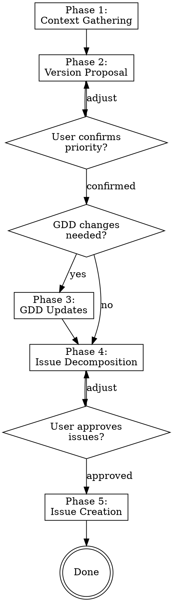

# `playbook:plan-version` Skill Implementation Plan

> **For agentic workers:** REQUIRED SUB-SKILL: Use superpowers:subagent-driven-development (recommended) or superpowers:executing-plans to implement this plan task-by-task. Steps use checkbox (`- [ ]`) syntax for tracking.

**Goal:** Create a Claude Code skill that acts as a lead engineer for version planning — reads the GDD, analyzes repo state, proposes conflict-free issues, and creates them on the GitHub project board for the playbook orchestrator to dispatch.

**Architecture:** A single skill (`SKILL.md`) installed at `~/.claude/skills/playbook-plan-version/SKILL.md` with one supporting reference file for the issue template. The skill is model-invoked (Claude uses it when the user wants to plan a version) and also user-invocable via `/playbook-plan-version`. A minor config update adds `gdd_path` to `config.yaml`.

**Tech Stack:** Claude Code skills (Markdown), GitHub CLI (`gh`), YAML config

---

### Task 1: Add `gdd_path` config field

**Files:**
- Modify: `config.yaml:1-50`
- Modify: `config.py` (if it validates config keys)
- Test: `tests/test_config.py`

- [ ] **Step 1: Read config.py to understand config loading**

Run: `cat -n config.py`
Understand how config keys are loaded and whether new keys need registration.

- [ ] **Step 2: Write a failing test for gdd_path config loading**

```python
def test_gdd_path_defaults_to_glob(tmp_path):
    """gdd_path should default to docs/*-gdd.md when not specified."""
    config_file = tmp_path / "config.yaml"
    config_file.write_text("repos:\n  - owner/repo\n")
    cfg = load_config(str(config_file))
    assert cfg.get("gdd_path", "docs/*-gdd.md") == "docs/*-gdd.md"


def test_gdd_path_reads_explicit_value(tmp_path):
    """gdd_path should use the explicit value when provided."""
    config_file = tmp_path / "config.yaml"
    config_file.write_text("repos:\n  - owner/repo\ngdd_path: docs/my-game-gdd.md\n")
    cfg = load_config(str(config_file))
    assert cfg["gdd_path"] == "docs/my-game-gdd.md"
```

- [ ] **Step 3: Run test to verify it fails**

Run: `python -m pytest tests/test_config.py -v -k "gdd_path"`
Expected: FAIL or PASS depending on whether config.py passes through unknown keys. If it already passes through, the test passes and no config.py changes are needed.

- [ ] **Step 4: Add gdd_path to config.yaml**

Add under the `versioning` section in `config.yaml`:

```yaml
gdd_path: "docs/paint-ballas-gdd.md"
```

- [ ] **Step 5: Run tests to verify they pass**

Run: `python -m pytest tests/test_config.py -v`
Expected: All PASS

- [ ] **Step 6: Commit**

```bash
git add config.yaml config.py tests/test_config.py
git commit -m "feat: add gdd_path config field for version planning skill"
```

---

### Task 2: Create the issue template reference file

**Files:**
- Create: `~/.claude/skills/playbook-plan-version/issue-template.md`

- [ ] **Step 1: Create the skill directory**

```bash
mkdir -p ~/.claude/skills/playbook-plan-version
```

- [ ] **Step 2: Write the issue template**

Create `~/.claude/skills/playbook-plan-version/issue-template.md`:

```markdown
# Issue Template for Playbook Versions

Use this template for every issue created by the plan-version skill.
Each issue serves as the single source of truth for coding, testing, and review agents.

## Template

### Title Format
`[vX.Y] Short description of the feature`

For bootstrap: `[bootstrap] Short description`

### Body

```
## Overview
Brief description of what this issue delivers and how it fits into the version milestone.

## Relevant GDD Sections
- Section X.Y — [quoted or summarized relevant requirements from the GDD]

## Acceptance Criteria
- [ ] Criterion 1 — specific, testable outcome
- [ ] Criterion 2 — specific, testable outcome
- [ ] Criterion 3 — specific, testable outcome

## Scope
**Files to create or modify:**
- `path/to/file.ext` — orientation context about what exists (if modifying) + what changes
- `path/to/new_file.ext` — new file, purpose and responsibility

**Do NOT touch:**
- `path/to/other.ext` — owned by issue #N in this version (only when max_coding > 1)

## Dependencies
- Assumes [vX.previous] work is merged: [brief description of what should already exist]
- If no prior version: "None — this is the first version" or "Assumes bootstrap is complete"

## Testing Criteria
- [ ] Expected behavior: [describe what should happen given specific input]
- [ ] Edge case: [describe boundary condition to test]
- [ ] Integration: [describe how this interacts with existing systems]
- [ ] Negative case: [describe what should NOT happen]

## Review Criteria
- [ ] GDD compliance: [specific GDD requirement to verify against]
- [ ] Architecture: [constraint to verify, e.g., "uses signals not direct references"]
- [ ] Code quality: [specific concern, e.g., "no hardcoded values for configurable settings"]

## Definition of Done
This issue is done when [concise statement tying acceptance criteria to testing validation].

## Notes
Any product-owner context, caveats, or edge-case guidance. Examples:
- "Placeholder art is fine — don't spend time on visuals"
- "The GDD says X but we may revisit — implement X for now"
- "This must work at 640x360 native resolution"
```

## Usage Notes

- Every field must be filled in. No "TBD" or "see GDD" without quoting the relevant part.
- The "Do NOT touch" section is only critical when max_coding > 1. Include it anyway for documentation but mark it as advisory when max_coding == 1.
- Testing criteria should be specific enough that the testing agent can write tests from them without re-reading the GDD.
- Review criteria should reference specific GDD sections or architectural decisions the review agent can verify.
- The Definition of Done should be a single sentence that an agent can evaluate as true/false.
```

- [ ] **Step 3: Commit**

```bash
git add ~/.claude/skills/playbook-plan-version/issue-template.md
git commit -m "feat: add issue template reference for plan-version skill"
```

---

### Task 3: Write the SKILL.md

**Files:**
- Create: `~/.claude/skills/playbook-plan-version/SKILL.md`

This is the core deliverable. The skill must guide Claude through the full version planning flow.

- [ ] **Step 1: Write the SKILL.md frontmatter and overview**

Create `~/.claude/skills/playbook-plan-version/SKILL.md`:

```markdown
---
name: playbook-plan-version
description: >
  Use when the user wants to plan the next version of a project managed by the
  playbook orchestrator, create agent-ready issues from a GDD/PRD, or says
  "let's plan the next version", "plan version", "create issues for the next
  version", or references version planning for orchestrated agent work.
---

# Plan Version — Playbook Orchestrator

## Overview

Act as a lead engineer running a version planning session. Read the GDD/PRD,
analyze the current repo state, propose the next version's scope, and create
conflict-free issues on the GitHub project board that coding, testing, and
review agents can execute independently.

The user is the product owner. You propose, they approve. Nothing hits the
board without their explicit go-ahead.
```

- [ ] **Step 2: Write the flow section**

Append to SKILL.md:

```markdown
## Flow


```

- [ ] **Step 3: Write Phase 1 — Context Gathering**

Append to SKILL.md:

```markdown
## Phase 1 — Context Gathering

Gather all context automatically. Do not ask the user anything in this phase.

1. **Read playbook config** — Find `config.yaml` in the playbook project directory
   (`/home/bryang/Dev_Space/playbook/config.yaml`). Extract:
   - `gdd_path` (or default to `docs/*-gdd.md` glob)
   - `repos` and `local_paths` — the target repo and its local checkout path
   - `project.owner` and `project.number` — for GitHub project board queries
   - `concurrency.max_coding` — to determine conflict avoidance rigor
   - `versioning` settings

2. **Read the GDD/PRD** — Read the file at `gdd_path` in the target repo's local checkout.
   Extract the roadmap/milestone table to understand version progression.

3. **Scan repo state** — In the target repo's local checkout:
   - `ls` the file tree to understand what has been built
   - `git log --oneline -20` to see recent work
   - Identify which GDD milestones are already implemented based on existing files

4. **Query project board** — Using `gh` CLI:
   ```bash
   gh project item-list <project_number> --owner <owner> --format json
   ```
   - List all existing issues and their statuses
   - Identify which versions exist and which are complete (all issues "Done")
   - Determine the next logical version number

5. **Summarize findings internally** — Build a mental model of:
   - What the GDD says should be built for the next version
   - What already exists in the repo
   - What the next version number should be
```

- [ ] **Step 4: Write Phase 2 — Version Proposal**

Append to SKILL.md:

```markdown
## Phase 2 — Version Proposal

Present your findings to the user and get confirmation.

**Message to user (adapt to context, don't use this verbatim):**

> Based on the project board, versions through [vX.Y] are complete. The next
> version is **[vX.Z]**.
>
> The GDD roadmap says [vX.Z] covers: **[milestone description from GDD]**.
>
> Here's what already exists in the repo: [brief summary of relevant files/features].
>
> Here's what would need to be built: [brief summary of the gap].
>
> **Does this priority look right, or would you like to adjust the scope?**
>
> **Also — are there any changes or additions to the GDD before we proceed?**

Wait for the user's response. If they adjust priority, update your plan. If they
want GDD changes, proceed to Phase 3. If everything is confirmed and no GDD
changes are needed, skip to Phase 4.
```

- [ ] **Step 5: Write Phase 3 — GDD Updates**

Append to SKILL.md:

```markdown
## Phase 3 — GDD Updates

If the user wants to adjust the GDD before proceeding:

1. Discuss the changes with the user — understand what they want added, removed, or clarified
2. Apply the changes directly to the GDD file using the Edit tool
3. Show the user the diff of what changed
4. Commit the updated GDD:
   ```bash
   git add <gdd_path>
   git commit -m "docs: update GDD for [vX.Y] planning"
   ```
5. Confirm: "GDD updated and committed. Proceeding with issue decomposition."

The GDD must be up-to-date before creating issues. Issues are derived from the
canonical GDD — never from stale requirements.
```

- [ ] **Step 6: Write Phase 4 — Issue Decomposition**

Append to SKILL.md:

```markdown
## Phase 4 — Issue Decomposition

Decompose the version milestone into individual issues. Use the issue template
from `issue-template.md` in this skill directory for the structure.

### Decomposition Rules

1. **Each issue must be independently executable** — A coding agent should be able
   to complete the issue without waiting for another issue in the same version to
   finish first.

2. **Scope files explicitly** — For each issue, identify exactly which files will
   be created or modified. Include orientation context (what exists, what changes).

3. **Conflict avoidance** — Adapt based on `max_coding` from config:

   **When `max_coding == 1` (default, recommended for game dev):**
   - Issues run sequentially. No file conflict risk.
   - Focus on clean scoping and logical ordering.
   - The orchestrator pipelines work (coding agent #1 → testing while coding agent starts #2).

   **When `max_coding > 1`:**
   - No two issues may modify the same file.
   - Scene files (`.tscn`, `.tres`) and project configs are atomic — one owner only.
   - For scripts: no overlapping modifications. Two issues may import/read a shared
     file, but only one may modify it.
   - If a version doesn't decompose cleanly for parallel execution, say so honestly.
     Recommend `max_coding: 1` for that version rather than force-fitting parallelism.

4. **Explain your reasoning** — When presenting issues, explain why they won't
   conflict and how you drew the boundaries. The user doesn't need raw file-overlap
   analysis, but they need to understand and trust your decomposition logic.

### Presenting Issues

Present each issue as a summary (title + 2-3 sentence description + key files).
Don't dump the full template yet — let the user review the decomposition first.

Example format:

> **Issue 1: `[v0.3] Implement FOV cone rendering`**
> Creates the vision cone system as a standalone node. New files:
> `scripts/fov_controller.gd`, `shaders/fov_mask.gdshader`.
> No modifications to existing files.
>
> **Issue 2: `[v0.3] Integrate FOV with coverage system`**
> Connects the FOV controller to the existing coverage tracker via signals.
> Modifies: `scripts/player.gd` (add FOV node reference).
> Creates: `scripts/fov_integration.gd`.

After the user reviews and approves the decomposition, expand each issue into the
full template from `issue-template.md`.

**Open the floor for discussion.** The user may want to:
- Split an issue that's too large
- Merge issues that are too granular
- Reorder priority within the version
- Adjust scope (defer something to the next version)
- Add notes or caveats to specific issues

Iterate until the user says the issue set is approved.
```

- [ ] **Step 7: Write Phase 5 — Issue Creation**

Append to SKILL.md:

```markdown
## Phase 5 — Issue Creation

Once the user approves the full issue set:

1. **Create each issue** on the GitHub project using `gh`:
   ```bash
   gh issue create \
     --repo <owner/repo> \
     --title "[vX.Y] Issue title" \
     --body "$(cat <<'EOF'
   <full issue body from template>
   EOF
   )"
   ```

2. **Add each issue to the project board** and set status to "ai-ready":
   ```bash
   # Get the issue's node ID
   gh issue view <number> --repo <owner/repo> --json id -q '.id'

   # Add to project
   gh project item-add <project_number> --owner <owner> --url <issue_url>

   # Set status to ai-ready using the project's status field
   gh project item-edit --project-id <project_id> --id <item_id> \
     --field-id <status_field_id> --single-select-option-id <ai_ready_option_id>
   ```

3. **Confirm creation** — List all created issues with their numbers and links:
   > Created 3 issues for [v0.3]:
   > - #15: [v0.3] Implement FOV cone rendering
   > - #16: [v0.3] Integrate FOV with coverage system
   > - #17: [v0.3] Add FOV visual overlay shader
   >
   > All set to "ai-ready". The orchestrator will pick them up on the next cycle.

**Important:** Use `gh` CLI commands, not the MCP GitHub tools, for issue creation.
The `gh` CLI is more reliable for setting project board fields.
```

- [ ] **Step 8: Write Red Flags and Common Mistakes sections**

Append to SKILL.md:

```markdown
## Red Flags

These thoughts mean STOP — you're about to skip a gate:

| Thought | Reality |
|---------|---------|
| "The user will probably approve this" | Ask. Every gate exists for a reason. |
| "The GDD is clear enough" | Ask if changes are needed. The user knows context you don't. |
| "These issues won't conflict" | Explain your reasoning. Let the user verify. |
| "I'll create the issues and they can adjust later" | Issues on the board get dispatched. Get approval first. |
| "This is just one small issue, no need for the full template" | Every issue goes through the full template. Agents need the context. |
| "The testing/review criteria are obvious" | Obvious to you ≠ obvious to a testing agent with no prior context. |

## Common Mistakes

- **Vague acceptance criteria** — "Implement the FOV system" is not a criterion. "Player's vision cone narrows from 360 to 30 degrees proportional to coverage %" is.
- **Missing testing criteria** — The testing agent can only validate what you specify. Be explicit about expected behaviors, edge cases, and inputs/outputs.
- **Skipping the GDD update step** — If requirements are ambiguous, update the GDD first. Don't create issues from ambiguous requirements.
- **Over-decomposing** — 3-5 issues per version is typical. More than 7 is a red flag that the version scope is too large.
- **Under-specifying file scope** — "Modify player.gd" is insufficient. "Modify `scripts/player.gd` — add `$FOVController` node reference and connect `coverage_changed` signal" tells the agent exactly what to do.
- **Forgetting dependencies** — Each issue must state what prior work it assumes exists. An agent working on v0.3 needs to know what v0.2 built.
```

- [ ] **Step 9: Verify the complete SKILL.md is well-formed**

Read the complete file back and verify:
- Frontmatter has `name` and `description`
- All 5 phases are present with clear gates
- Flowchart is valid DOT syntax
- Issue template reference is correct
- Red flags and common mistakes are actionable

- [ ] **Step 10: Commit**

```bash
git add ~/.claude/skills/playbook-plan-version/SKILL.md
git commit -m "feat: add playbook-plan-version skill for version planning"
```

---

### Task 4: Test the skill with a dry run

**Files:**
- No files created — this is a validation step

- [ ] **Step 1: Verify skill is discoverable**

Start a new Claude Code conversation and check if the skill appears in the available skills list. Look for `playbook-plan-version` in the system reminder listing skills.

- [ ] **Step 2: Invoke the skill**

In the test conversation, say: "Let's plan the next version for paint-ballas-auto"

Verify that Claude:
- Reads `config.yaml`
- Reads the GDD
- Scans the repo
- Queries the project board
- Proposes the next version with priority
- Waits for user confirmation before proceeding

- [ ] **Step 3: Walk through the full flow**

Continue the conversation through all 5 phases. Verify each gate works:
- Phase 2: Does it wait for priority confirmation?
- Phase 3: Does it offer GDD updates and commit them?
- Phase 4: Does it present issues in summary form first, then expand?
- Phase 5: Does it create issues with the correct template?

- [ ] **Step 4: Verify issue quality**

Check a created issue on GitHub:
- Title has correct `[vX.Y]` tag
- Body follows the full template
- All sections are filled in (no TBD/TODO)
- Testing criteria are specific enough for a testing agent
- Review criteria reference specific GDD sections
- Definition of Done is a single evaluatable statement

- [ ] **Step 5: Document any issues found**

If the skill needs adjustments based on the dry run, note them for a follow-up commit.

---

### Task 5: Update playbook config with recommended defaults

**Files:**
- Modify: `config.yaml`

- [ ] **Step 1: Update max_coding default to 1**

Based on the design discussion, update `config.yaml`:

```yaml
concurrency:
  max_coding: 1  # sequential execution — safe default for game dev
  max_testing: 1
  max_review: 1
```

- [ ] **Step 2: Add gdd_path**

Add to `config.yaml` (if not already added in Task 1):

```yaml
gdd_path: "docs/paint-ballas-gdd.md"
```

- [ ] **Step 3: Run existing tests**

Run: `python -m pytest --tb=short`
Expected: All existing tests pass (config change shouldn't break anything)

- [ ] **Step 4: Commit**

```bash
git add config.yaml
git commit -m "chore: set max_coding to 1 and add gdd_path config"
```
