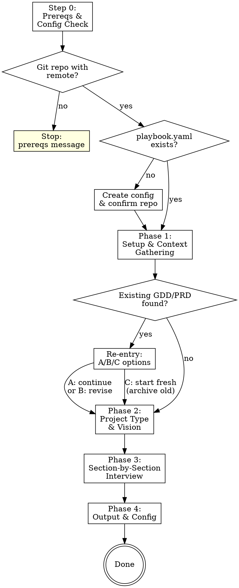
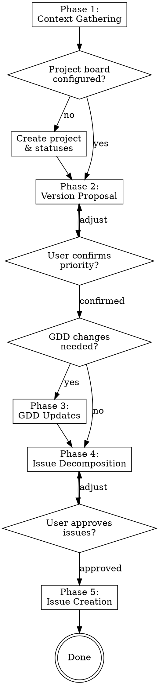

# Pipeline Auto-Setup Implementation Plan

> **For agentic workers:** REQUIRED SUB-SKILL: Use superpowers:subagent-driven-development (recommended) or superpowers:executing-plans to implement this plan task-by-task. Steps use checkbox (`- [ ]`) syntax for tracking.

**Goal:** Eliminate manual setup steps when starting a new project — scout auto-creates `playbook.yaml`, gameplan auto-creates the GitHub Project with status fields.

**Architecture:** Two skill file modifications. Scout gets a prereq check + config creation step in Phase 1. Gameplan gets a project board setup step in Phase 1. Both follow the "you propose, they approve" pattern with user confirmation gates.

**Tech Stack:** Markdown skill files, GitHub CLI (`gh`), GraphQL mutations for project field management

---

## File Structure

```
skills/
  scout/
    SKILL.md          # Modify: add Step 0 (prereq check + config creation)
  gameplan/
    SKILL.md          # Modify: add Step 1b (project board setup)
```

---

### Task 1: Update Scout — Add prerequisite check and config creation

**Files:**
- Modify: `skills/scout/SKILL.md:29-103` (flow diagram and Phase 1)

- [ ] **Step 1: Update the flow diagram**

In `skills/scout/SKILL.md`, replace the existing flow diagram (lines 29-48) with a new one that includes the prereq and config check:



- [ ] **Step 2: Add Step 0 before Phase 1**

Insert the following section in `skills/scout/SKILL.md` immediately before the existing `## Phase 1 — Setup & Context Gathering` line:

```markdown
## Step 0 — Prerequisites & Config Check

Before gathering context, verify the environment can support playbook.

### Prerequisite check

1. Verify this is a git repo:
   ```bash
   git rev-parse --git-dir
   ```

2. Verify a remote exists:
   ```bash
   git remote get-url origin
   ```

3. If either check fails, stop and tell the user:
   > **Prerequisites for Playbook:**
   > 1. A local git repo with a GitHub remote (`git remote -v` to check)
   > 2. A GitHub repository (create one with `gh repo create` if needed)
   >
   > Once your repo and remote are ready, run `/playbook:scout` again.

### Config creation

If prerequisites pass but no `playbook.yaml` exists in the current directory:

1. Parse the repo identifier from the remote URL:
   ```bash
   git remote get-url origin
   ```
   - `git@github.com:BryGo1995/my-new-game.git` → `BryGo1995/my-new-game`
   - `https://github.com/BryGo1995/my-new-game.git` → `BryGo1995/my-new-game`

2. Confirm with the user:
   > "No `playbook.yaml` found. I'll create one for this project.
   > Repo detected as **BryGo1995/my-new-game** — is that right?"

   Wait for confirmation. If the user corrects the repo name, use their value.

3. Create `playbook.yaml` with:
   ```yaml
   repo: BryGo1995/my-new-game
   ```

4. Commit:
   ```bash
   git add playbook.yaml
   git commit -m "chore: initialize playbook.yaml"
   ```

5. Continue to Phase 1.

If `playbook.yaml` already exists, skip this step entirely and proceed to
Phase 1.
```

- [ ] **Step 3: Update the Phase 1 Step 1 description**

In the existing Phase 1 content, the first step currently reads:

```markdown
1. **Check for an existing GDD/PRD** — two steps:
   - Read `playbook.yaml` in the current working directory. If `gdd_path` is set,
     that is the authoritative pointer to the existing document.
   - If `gdd_path` is absent or empty, scan `docs/` (relative to the target
     project directory, where the user invoked scout) for files matching
     `*-gdd.md` or `*-prd.md`.
```

This remains unchanged — by the time Phase 1 runs, `playbook.yaml` is guaranteed to exist (either it was already there, or Step 0 just created it).

- [ ] **Step 4: Commit**

```bash
git add skills/scout/SKILL.md
git commit -m "feat: scout auto-creates playbook.yaml with prereq check"
```

---

### Task 2: Update Gameplan — Add project board setup

**Files:**
- Modify: `skills/gameplan/SKILL.md:24-85` (flow diagram and Phase 1)

- [ ] **Step 1: Update the flow diagram**

In `skills/gameplan/SKILL.md`, replace the existing flow diagram (lines 24-48) with a new one that includes the project board check:



- [ ] **Step 2: Add Step 1b after the config read**

In `skills/gameplan/SKILL.md`, insert the following section immediately after the existing Phase 1 Step 1 ("Read playbook config") and before Step 2 ("Read the GDD/PRD"):

```markdown
1b. **Check project board config** — After reading `playbook.yaml`, check if
    `project.number` and `project.status_field_id` are present. If either is
    missing, the GitHub Project hasn't been set up yet.

    **If project board is not configured:**

    a. Derive a project name from the repo:
       `BryGo1995/my-new-game` → `My New Game`
       (split on `/`, take the repo name, replace `-` with spaces, title case)

    b. Confirm with the user:
       > "No GitHub Project board configured for this repo. I'll create one
       > to track agent work.
       >
       > Project name: **My New Game** — want to change it?"

       Wait for confirmation. If the user provides a different name, use it.

    c. Create the project and link the repo:
       ```bash
       gh project create --owner <owner> --title "<project name>" --format json
       ```
       Extract the project number from the JSON response.

       ```bash
       gh project link <project_number> --owner <owner> --repo <owner>/<repo>
       ```

    d. Get the project ID and Status field ID via GraphQL:
       ```bash
       gh api graphql -f query='
         query($owner: String!, $number: Int!) {
           user(login: $owner) {
             projectV2(number: $number) {
               id
               field(name: "Status") {
                 ... on ProjectV2SingleSelectField {
                   id
                   options {
                     id
                     name
                   }
                 }
               }
             }
           }
         }
       ' -f owner="<owner>" -F number=<project_number>
       ```
       Extract `project_id`, `status_field_id`, and the list of existing
       status options (new projects come with `Todo`, `In Progress`, `Done`).

    e. Add playbook status options. For each status that doesn't already exist
       (`Backlog`, `ai-ready`, `ai-in-progress`, `ai-testing`, `ai-review`,
       `ai-complete`, `ai-blocked`, `ai-error`, `Done`), create it:
       ```bash
       gh api graphql -f query='
         mutation($projectId: ID!, $fieldId: ID!, $name: String!) {
           createProjectV2FieldOption(input: {
             projectId: $projectId
             fieldId: $fieldId
             name: $name
           }) {
             projectV2Field {
               ... on ProjectV2SingleSelectField {
                 options { id name }
               }
             }
           }
         }
       ' -f projectId="<project_id>" -f fieldId="<status_field_id>" \
         -f name="<status_name>"
       ```

       Skip `Done` — it already exists on new projects.

    f. Remove default statuses that playbook doesn't use. Delete `Todo` and
       `In Progress`:
       ```bash
       gh api graphql -f query='
         mutation($projectId: ID!, $fieldId: ID!, $optionId: String!) {
           deleteProjectV2FieldOption(input: {
             projectId: $projectId
             fieldId: $fieldId
             optionId: $optionId
           }) {
             projectV2Field {
               ... on ProjectV2SingleSelectField {
                 options { id name }
               }
             }
           }
         }
       ' -f projectId="<project_id>" -f fieldId="<status_field_id>" \
         -f optionId="<option_id>"
       ```

       Use the option IDs retrieved in step (d) to identify `Todo` and
       `In Progress`.

    g. Update `playbook.yaml` with the project config:
       ```yaml
       repo: BryGo1995/my-new-game
       project:
         owner: BryGo1995
         number: 3
         status_field_id: "PVTSSF_lAHOAmiy..."
       ```

       Use the Edit tool to add the `project:` block to the existing
       `playbook.yaml`. Do not overwrite other fields (like `repo` and
       `gdd_path` which scout already set).

    h. Commit:
       ```bash
       git add playbook.yaml
       git commit -m "chore: configure GitHub Project board"
       ```

    i. Confirm to the user:
       > "GitHub Project **My New Game** created and configured with playbook
       > statuses. Continuing with version planning."

    **If project board is already configured:** Skip this step and continue
    to Step 2 (Read the GDD/PRD).
```

- [ ] **Step 3: Update the existing Phase 1 Step 1 error handling**

In the existing Phase 1 Step 1, change the error message from:

```markdown
1. **Read playbook config** — Read `playbook.yaml` in the current working
   directory. If not found, stop and tell the user:
   > "No `playbook.yaml` found in the current directory. Run this skill from a
   > repo that has a `playbook.yaml`."
```

to:

```markdown
1. **Read playbook config** — Read `playbook.yaml` in the current working
   directory. If not found, stop and tell the user:
   > "No `playbook.yaml` found in the current directory. Run
   > `/playbook:scout` first to create your GDD/PRD and initialize the
   > config."
```

This directs users to the correct entry point instead of expecting them to
create the file manually.

- [ ] **Step 4: Commit**

```bash
git add skills/gameplan/SKILL.md
git commit -m "feat: gameplan auto-creates GitHub Project with status fields"
```

---

### Task 3: Update gameplan error message for missing project board in Phase 1 Step 4

**Files:**
- Modify: `skills/gameplan/SKILL.md` (Phase 1, Step 4 — Query project board)

The existing Step 4 queries the project board but doesn't handle the case
where the query fails. After Task 2, the project board is guaranteed to exist
by the time Step 4 runs, but the query could still fail for other reasons
(permissions, network).

- [ ] **Step 1: Verify Step 4 context**

Read the existing Step 4 in `skills/gameplan/SKILL.md` and confirm it
currently just runs the `gh project item-list` command without error handling.
No change needed here — the step is fine as-is because Step 1b now guarantees
the project exists. This task exists only to verify nothing is broken by the
new Step 1b.

- [ ] **Step 2: Final review**

Read the complete `skills/gameplan/SKILL.md` end-to-end. Verify:
- The flow diagram includes the new "Project board configured?" decision node
- Step 1b is positioned between Step 1 and Step 2
- Step 1's error message points to `/playbook:scout`
- The rest of the file is unchanged

- [ ] **Step 3: Commit (if any fixes needed)**

Only commit if the review in Step 2 found issues that needed fixing.

```bash
git add skills/gameplan/SKILL.md
git commit -m "fix: address review findings in gameplan Phase 1"
```
