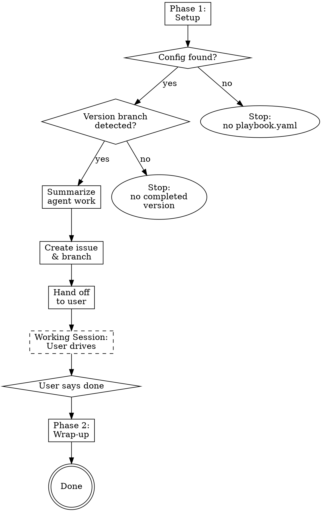

# Film Room — Playbook Orchestrator

## Overview

Act as a senior engineer running a post-agent review session. Set up the
tracking infrastructure (issue, branch), help the user fix problems they
identify, and handle the merge-back when they're done.

The user is the reviewer. They identify problems, you fix them. Nothing gets
added to the checklist without their direction.

Film room supports one mode: review a completed version branch. One session
reviews one version. To review multiple versions, invoke the skill multiple
times.

## Flow



## Phase 1 — Setup

Gather context and set up the tracking infrastructure. Do not ask the user
anything until the hand-off step.

### Step 1 — Read config

1. Read `playbook.yaml` in the current working directory. If not found, stop:
   > "No `playbook.yaml` found in the current directory. Run this skill from a
   > repo that has a `playbook.yaml`."

2. Extract:
   - `repo` — the GitHub repo identifier (e.g., `BryGo1995/paint-ballas-auto`)
   - `project.owner` and `project.number` — for project board queries
   - `gdd_path` — to reference the GDD if needed for context

### Step 2 — Detect version branch

1. Check the current git branch: `git branch --show-current`
2. If the current branch matches `ai/dev-v*` or `ai/dev-bootstrap`, use it as
   the version branch. Extract the version from the branch name.
3. Otherwise, auto-detect:
   - Query the project board:
     ```bash
     gh project item-list <project_number> --owner <owner> --format json
     ```
   - Parse issue titles for version tags (`[vX.Y]`).
   - Find the highest completed version — the version with the largest
     `(major, minor)` tuple where all issues are in `Done` or `ai-complete`
     status.
   - Derive the branch name: `ai/dev-v{major}.{minor}` (or `ai/dev-bootstrap`
     for version `(0, 0)`).
4. If no completed version is found, stop:
   > "No completed version found on the project board. Film room is for
   > reviewing finished agent work."
5. Verify the branch exists on the remote:
   ```bash
   git ls-remote --heads origin <version_branch>
   ```
   If it doesn't exist, stop:
   > "Branch `<version_branch>` not found on remote. Has the agent work been
   > pushed?"

### Step 3 — Summarize agent work

1. Fetch latest:
   ```bash
   git fetch origin
   ```

2. Get file-level diff summary:
   ```bash
   git diff main...origin/<version_branch> --stat
   ```

3. Query project board for all issues in this version — list their titles and
   statuses.

4. List merged PRs targeting the version branch:
   ```bash
   gh pr list --repo <repo> --base <version_branch> --state merged
   ```

5. Present a concise summary to the user:
   - Version being reviewed
   - What was built (issue titles and their statuses)
   - How many files changed
   - Which PRs were merged

### Step 4 — Create tracking issue

1. Read the issue template from `issue-template.md` in this skill directory.

2. Create the issue:
   ```bash
   gh issue create --repo <repo> \
     --title "[vX.Y] Film Room: Post-Agent Review" \
     --body "$(cat <<'EOF'
   ## Film Room: vX.Y Post-Agent Review

   **Branch:** `film-room/vX.Y`
   **Version branch:** `ai/dev-vX.Y`

   ## Fixes
   (items added during session)

   ## Notes
   EOF
   )"
   ```

   For bootstrap versions, use `[bootstrap]` instead of `[vX.Y]`.

3. Add the issue to the project board:
   ```bash
   gh project item-add <project_number> --owner <owner> --url <issue_url>
   ```

4. Store the issue number and the current issue body in conversation context
   for later updates.

### Step 5 — Create fix branch

1. Check if `film-room/vX.Y` exists locally or remotely:
   ```bash
   git branch --list film-room/vX.Y
   git ls-remote --heads origin film-room/vX.Y
   ```

2. If it exists, delete it (previous session, already merged):
   - Local: `git branch -D film-room/vX.Y` (ignore errors if not local)
   - Remote: `git push origin --delete film-room/vX.Y` (ignore errors if not
     remote)

3. Make sure local tracking is up to date:
   ```bash
   git checkout <version_branch>
   git pull origin <version_branch>
   ```

4. Create and push the fix branch:
   ```bash
   git checkout -b film-room/vX.Y
   git push -u origin film-room/vX.Y
   ```

### Step 6 — Hand off

Present a confirmation message to the user:

> **Film room is set up for vX.Y.**
>
> - **Tracking issue:** #N — [link]
> - **Fix branch:** `film-room/vX.Y`
> - **Reviewing:** `ai/dev-vX.Y`
>
> Tell me what needs fixing. I'll add items to the tracking issue as we go
> and check them off when done.
>
> When you're finished, say "let's wrap up" and I'll handle the merge.

## Working Session (Between Phases)

The skill does not control this period. The user drives — they identify
problems and direct fixes. Your responsibilities:

### When the user identifies a problem

1. Add an unchecked item to the issue body: `- [ ] Description of fix`
2. Update the issue on GitHub:
   ```bash
   gh issue edit <issue_number> --repo <repo> --body "<full updated body>"
   ```
3. Confirm: "Added to the checklist. Let me fix that."

### When a fix is committed

1. Check off the item in the issue body: `- [x] Description of fix`
2. Update the issue on GitHub with the same `gh issue edit` command.
3. Confirm the fix is done and the checklist is updated.

### When new problems are discovered during a fix

Append them to the checklist. The list grows organically — no upfront lock-in.

### Issue body management

Maintain the full issue body in conversation context. On each update, replace
the entire body via `gh issue edit --body`. This is simpler and more reliable
than trying to patch individual checklist items via the API.

### Guidelines

- **Stay on the fix branch.** All commits go to `film-room/vX.Y`.
- **Commit each fix individually.** One fix = one commit. This makes the
  merge-back diff reviewable.
- **Don't scope-creep.** If the user identifies something that needs a
  redesign or new feature, suggest creating a separate issue for the next
  version via gameplan. Film room is for fixes, not new work.
- **Push periodically.** Push to remote after each fix so the branch is
  backed up:
  ```bash
  git push origin film-room/vX.Y
  ```

## Phase 2 — Wrap-up

Triggered when the user indicates they are done (e.g., "let's wrap up",
"I'm done", "merge it back"). Wrap-up runs the merge, then the learning
distillers (Step 4.5), then cleanup.

### Step 1 — Status check

1. Compare the fix branch against the version branch:
   ```bash
   git log origin/<version_branch>..film-room/vX.Y --oneline
   ```

2. If no commits ahead, ask the user:
   > "No changes on the fix branch. Close the issue and delete the branch
   > without merging?"
   If they confirm, skip to Step 5 (clean up).

### Step 2 — Update tracking issue

1. Review the checklist in the issue body.
2. If any items are still unchecked, ask the user:
   > "These items are still unchecked:
   > - [ ] Item A
   > - [ ] Item B
   >
   > Are you leaving them for later, or do they still need to be addressed?"
3. If the user wants to address them, return to the working session.
4. If leaving for later, add a note to the issue body under "## Notes"
   explaining they were deferred.
5. Push the final issue body update to GitHub.

### Step 3 — Offer merge strategy

Present two options:

> **How would you like to merge the fixes?**
>
> **A) Pull Request** — I'll create a PR from `film-room/vX.Y` →
> `ai/dev-vX.Y` with a summary of all fixes. You can review the diff one
> more time before merging.
>
> **B) Direct merge** — I'll merge `film-room/vX.Y` into `ai/dev-vX.Y`
> locally and push. No extra review step.

Wait for the user's choice.

### Step 4 — Execute merge

**If Pull Request (A):**

1. Push any unpushed commits:
   ```bash
   git push origin film-room/vX.Y
   ```

2. Build the PR body from the checklist — list all fixes that were applied.

3. Create the PR:
   ```bash
   gh pr create --repo <repo> \
     --base <version_branch> \
     --head film-room/vX.Y \
     --title "[vX.Y] Film Room Fixes" \
     --body "$(cat <<'EOF'
   ## Summary

   Post-agent review fixes for vX.Y.

   ## Fixes Applied
   - Fix 1 description
   - Fix 2 description

   Closes #<tracking_issue_number>
   EOF
   )"
   ```

4. Tell the user:
   > "PR created: [link]. Merge when you're ready — I'll clean up after."

   Wait for the user to confirm the PR is merged before proceeding to Step 5.

**If Direct merge (B):**

1. Push any unpushed commits:
   ```bash
   git push origin film-room/vX.Y
   ```

2. Merge into the version branch:
   ```bash
   git checkout <version_branch>
   git merge film-room/vX.Y
   git push origin <version_branch>
   ```

3. Proceed to Step 5.

### Step 4.5 — Run distillers

Two distillers run after the merge but before cleanup. Each is a `claude
-p` invocation that consumes the film-room data and either opens a PR or
exits cleanly with no PR. Both are skipped when:

- `learning.enabled` is `false` in `playbook.yaml` (use the merged config
  from `defaults.yaml` + `playbook.yaml`), **OR**
- the fix branch had zero commits ahead of the version branch (already
  the early-exit path from Step 1).

Skip individual distillers when their toggle is false:
- `learning.project_distiller: false` → skip the project distiller.
- `learning.agent_craft_distiller: false` → skip the agent-craft
  distiller.

#### Gather the input bundle (shared by both distillers)

Run these commands and capture each output for use in both distiller
invocations. All paths are absolute or rooted at the project repo's
working tree.

1. **Tracking issue body:**
   ```bash
   gh issue view <issue_number> --repo <repo> --json body --jq .body
   ```

2. **Fix commits with diffs:**
   ```bash
   git log origin/<version_branch>..film-room/<version_label> --patch
   ```
   Where `<version_label>` is `vX.Y` or `bootstrap` to match the branch.

3. **Original agent PRs for this version** (titles, bodies, diff URLs):
   ```bash
   gh pr list --repo <repo> --base <version_branch> --state merged \
     --json number,title,body,url
   ```

4. **Original issues** the agents worked on — for each PR from step 3,
   parse `Closes #N` / `Fixes #N` references from the PR body, then:
   ```bash
   gh issue view <N> --repo <repo> --json title,body
   ```

Combine all of the above into a single text bundle. The exact format does
not matter; the distillers are told what fields to expect.

#### Run the project distiller

Skip this section if `learning.project_distiller` is false.

1. Read the current `CLAUDE.md` from the project repo's working tree
   (empty string if it does not exist):
   ```bash
   test -f CLAUDE.md && cat CLAUDE.md || echo ""
   ```

2. Read the distiller prompt:
   ```bash
   cat <playbook_repo_path>/skills/film-room/distillers/project-distiller.md
   ```
   Replace `<playbook_repo_path>` with the absolute path to the playbook
   repo on the operator's machine. (You can locate it via the skill's own
   directory: the prompt file lives next to `SKILL.md`.)

3. Build the distiller invocation. Pass the prompt + the input bundle +
   the current `CLAUDE.md` + the repo identifier + the version label as
   the `claude -p` prompt body. The distiller is told to emit JSON-only.

   ```bash
   claude -p --output-format json --max-budget-usd 1.0 "$DISTILLER_PROMPT_WITH_INPUTS" > /tmp/project-distiller.json
   ```

4. Parse the JSON output:
   ```bash
   jq -r .claude_md /tmp/project-distiller.json
   jq -r .pr_body  /tmp/project-distiller.json
   jq -r .lessons_added /tmp/project-distiller.json
   ```

5. **If `claude_md` is `null` or `lessons_added` is `0`**, tell the user:
   > "Project distiller ran but proposed no lessons (every fix was a local
   > incident or already covered in CLAUDE.md). No PR opened."
   Skip to the agent-craft distiller.

6. **Otherwise**, open a PR against the project repo:
   ```bash
   git checkout -b learning/film-room-vX.Y origin/main
   # Write the new CLAUDE.md from the distiller output:
   jq -r .claude_md /tmp/project-distiller.json > CLAUDE.md
   git add CLAUDE.md
   git commit -m "chore: capture lessons from vX.Y film-room"
   git push -u origin learning/film-room-vX.Y
   gh pr create --repo <repo> \
     --base main \
     --head learning/film-room-vX.Y \
     --title "Lessons from vX.Y film-room" \
     --body "$(jq -r .pr_body /tmp/project-distiller.json)"
   ```
   Tell the user the PR URL.

#### Run the agent-craft distiller

Skip this section if `learning.agent_craft_distiller` is false.

1. Resolve the playbook repo identifier from the merged config:
   `learning.playbook_repo` (default `BryGo1995/playbook`).

2. Read the current playbook agent prompts and the observations log from
   the playbook repo. Use `gh api` so the operator does not need a local
   clone:
   ```bash
   gh api repos/<playbook_repo>/contents/agents/coding.py   --jq .content | base64 -d
   gh api repos/<playbook_repo>/contents/agents/review.py   --jq .content | base64 -d
   gh api repos/<playbook_repo>/contents/agents/testing.py  --jq .content | base64 -d
   gh api repos/<playbook_repo>/contents/docs/agent-craft-observations.md --jq .content | base64 -d
   ```

3. Read the agent-craft distiller prompt (sibling of `SKILL.md`):
   ```bash
   cat <playbook_repo_path>/skills/film-room/distillers/agent-craft-distiller.md
   ```

4. Build the distiller invocation. Pass: the prompt + the input bundle +
   the three agent files + the observations log + the playbook repo id +
   the project repo id + the version + today's date + the project
   film-room issue URL.

   ```bash
   claude -p --output-format json --max-budget-usd 1.0 "$AGENT_CRAFT_PROMPT_WITH_INPUTS" > /tmp/agent-craft.json
   ```

5. Parse the JSON output:
   ```bash
   MODE=$(jq -r .mode /tmp/agent-craft.json)
   TARGET=$(jq -r .target_file /tmp/agent-craft.json)
   ```

6. **If `mode` is `"skip"`**, tell the user:
   > "Agent-craft distiller ran and found no agent-craft signals this
   > session. No PR opened."
   Done with distillers.

7. **Otherwise**, open a PR against the playbook repo. The branch name
   encodes the project + version so concurrent sessions do not collide:
   ```bash
   BRANCH="learning/<project_repo_slug>-vX.Y"
   # Use the GitHub API to create or update the file on the new branch
   # (avoids requiring a local clone of the playbook repo):
   gh api -X PUT repos/<playbook_repo>/contents/$TARGET \
     -f message="agent-craft: $MODE from <project_repo> vX.Y" \
     -f content="$(jq -r .patched_file_contents /tmp/agent-craft.json | base64 -w0)" \
     -f branch="$BRANCH" \
     -f sha="<sha_of_existing_file_or_omit_if_new>"
   gh pr create --repo <playbook_repo> \
     --base main \
     --head "$BRANCH" \
     --title "agent-craft: $MODE from <project_repo> vX.Y film-room" \
     --body "$(jq -r .pr_body /tmp/agent-craft.json)"
   ```
   Replace `<project_repo_slug>` with `<repo>` lowercased and with `/`
   replaced by `-`. Get the existing file's SHA via:
   ```bash
   gh api repos/<playbook_repo>/contents/$TARGET --jq .sha
   ```
   Omit `-f sha=...` only if the file does not exist yet (e.g. first-ever
   `docs/agent-craft-observations.md` write — but Task 4 of the rollout
   plan seeded that file, so it already exists).

   Tell the user the PR URL.

#### Tell the user what happened

Before moving to Step 5, summarize:

> "Distillers complete:
> - Project distiller: <PR link, or 'no lessons proposed'>
> - Agent-craft distiller: <PR link, or 'no signals this session'>"

### Step 5 — Clean up

1. Delete the fix branch:
   ```bash
   git branch -D film-room/vX.Y
   git push origin --delete film-room/vX.Y
   ```

2. Close the tracking issue with a summary comment:
   ```bash
   gh issue close <issue_number> --repo <repo> --comment "$(cat <<'EOF'
   Film room session complete.
   Fixed N items. Changes merged to <version_branch> via [PR #N / direct merge].
   EOF
   )"
   ```

3. Present a final summary to the user:
   > **Film room complete for vX.Y.**
   >
   > - **Fixes applied:** N
   > - **Files changed:** [count]
   > - **Merged to:** `ai/dev-vX.Y` via [PR / direct merge]
   > - **Tracking issue:** #N (closed)

## Red Flags

These thoughts mean STOP — you're about to skip a gate:

| Thought | Reality |
|---------|---------|
| "I'll start fixing before setup is done" | Complete Phase 1 first. The tracking issue is the record. |
| "This fix is small, no need to add it to the checklist" | Every fix goes on the checklist. The issue is the audit trail. |
| "I'll batch these checklist updates" | Update the issue after each fix. Stale checklists defeat the purpose. |
| "The user said wrap up but there are unchecked items" | Ask about them. Don't silently close incomplete work. |
| "This needs a redesign, I'll do it in film room" | Film room is for fixes. Redesigns go to gameplan as new issues. |
| "I'll merge without asking which strategy" | Always offer the choice. The user may want to review the diff. |

## Common Mistakes

- **Forgetting to push the fix branch** — Push after each fix. The branch
  should always be backed up on the remote.
- **Not updating the issue body** — The GitHub issue is the persistent record.
  Conversation context is ephemeral. Keep the issue in sync.
- **Scope creep** — A film room session is for fixing what the agents built,
  not for adding new features. If something needs new work, suggest a gameplan
  issue.
- **Merging to main instead of the version branch** — The fix branch targets
  the version branch (`ai/dev-vX.Y`), never `main`. The version branch gets
  merged to main separately.
- **Leaving stale branches** — Always clean up `film-room/vX.Y` in Step 5,
  both local and remote.
- **Closing the issue without a summary** — The close comment is the record
  of what happened. Always include the fix count and merge method.
- **Skipping the distillers** — Step 4.5 runs both distillers automatically
  unless `learning.enabled: false`. Do not skip them to "save time" —
  every skipped session is signal lost forever (no backfill in v1).
