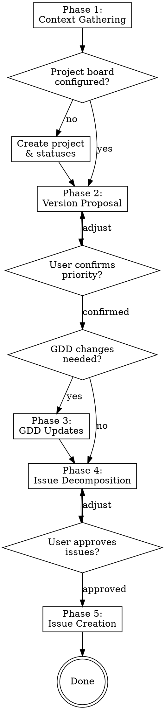

# Plan Version — Playbook Orchestrator

## Overview

Act as a lead engineer running a version planning session. Read the GDD/PRD,
analyze the current repo state, propose the next version's scope, and create
conflict-free issues on the GitHub project board that coding, testing, and
review agents can execute independently.

The user is the product owner. You propose, they approve. Nothing hits the
board without their explicit go-ahead.

## Flow



## Phase 1 — Context Gathering

Gather all context automatically. Do not ask the user anything in this phase.

1. **Read playbook config** — Read `playbook.yaml` in the current working
   directory. If not found, stop and tell the user:
   > "No `playbook.yaml` found in the current directory. Run
   > `/playbook:scout` first to create your GDD/PRD and initialize the
   > config."

   Extract:
   - `repo` — the GitHub repo identifier (e.g., `BryGo1995/paint-ballas-auto`)
   - `gdd_path` (or default to `docs/*-gdd.md` glob if not set)
   - `project.owner` and `project.number` — for GitHub project board queries
   - `concurrency.max_coding` — determines conflict avoidance rigor
   - `versioning` settings

1b. **Check project board config** — After reading `playbook.yaml`, check if
    `project.number` and `project.status_field_id` are present. If either is
    missing, the GitHub Project hasn't been set up yet.

    **If project board is not configured:**

    a. Derive a project name from the repo:
       `BryGo1995/my-new-game` → `My New Game`
       (split on `/`, take the repo name, replace `-` with spaces, title case)

    b. Confirm with the user:
       > "No GitHub Project board configured for this repo. I'll create one
       > to track agent work.
       >
       > Project name: **My New Game** — want to change it?"

       Wait for confirmation. If the user provides a different name, use it.

    c. Create the project and link the repo:
       ```bash
       gh project create --owner <owner> --title "<project name>" --format json
       ```
       Extract the project number from the JSON response.

       ```bash
       gh project link <project_number> --owner <owner> --repo <owner>/<repo>
       ```

    d. Get the project ID and Status field ID via GraphQL:
       ```bash
       gh api graphql -f query='
         query($owner: String!, $number: Int!) {
           user(login: $owner) {
             projectV2(number: $number) {
               id
               field(name: "Status") {
                 ... on ProjectV2SingleSelectField {
                   id
                   options {
                     id
                     name
                   }
                 }
               }
             }
           }
         }
       ' -f owner="<owner>" -F number=<project_number>
       ```
       Extract `project_id`, `status_field_id`, and the list of existing
       status options (new projects come with `Todo`, `In Progress`, `Done`).

    e. Add playbook status options. For each status that doesn't already exist
       (`Backlog`, `ai-ready`, `ai-in-progress`, `ai-testing`, `ai-review`,
       `ai-complete`, `ai-blocked`, `ai-error`, `Done`), create it:
       ```bash
       gh api graphql -f query='
         mutation($projectId: ID!, $fieldId: ID!, $name: String!) {
           createProjectV2FieldOption(input: {
             projectId: $projectId
             fieldId: $fieldId
             name: $name
           }) {
             projectV2Field {
               ... on ProjectV2SingleSelectField {
                 options { id name }
               }
             }
           }
         }
       ' -f projectId="<project_id>" -f fieldId="<status_field_id>" \
         -f name="<status_name>"
       ```

       Skip `Done` — it already exists on new projects.

    f. Remove default statuses that playbook doesn't use. Delete `Todo` and
       `In Progress`:
       ```bash
       gh api graphql -f query='
         mutation($projectId: ID!, $fieldId: ID!, $optionId: String!) {
           deleteProjectV2FieldOption(input: {
             projectId: $projectId
             fieldId: $fieldId
             optionId: $optionId
           }) {
             projectV2Field {
               ... on ProjectV2SingleSelectField {
                 options { id name }
               }
             }
           }
         }
       ' -f projectId="<project_id>" -f fieldId="<status_field_id>" \
         -f optionId="<option_id>"
       ```

       Use the option IDs retrieved in step (d) to identify `Todo` and
       `In Progress`.

    g. Update `playbook.yaml` with the project config:
       ```yaml
       repo: BryGo1995/my-new-game
       project:
         owner: BryGo1995
         number: 3
         status_field_id: "PVTSSF_lAHOAmiy..."
       ```

       Use the Edit tool to add the `project:` block to the existing
       `playbook.yaml`. Do not overwrite other fields (like `repo` and
       `gdd_path` which scout already set).

    h. Commit:
       ```bash
       git add playbook.yaml
       git commit -m "chore: configure GitHub Project board"
       ```

    i. Confirm to the user:
       > "GitHub Project **My New Game** created and configured with playbook
       > statuses. Continuing with version planning."

    **If project board is already configured:** Skip this step and continue
    to Step 2 (Read the GDD/PRD).

2. **Read the GDD/PRD** — Read the file at `gdd_path` in the current working
   directory. Extract the roadmap/milestone table to understand version progression.

3. **Scan repo state** — In the current working directory:
   - List the file tree to understand what has been built
   - Run `git log --oneline -20` to see recent work
   - Identify which GDD milestones are already implemented based on existing files

4. **Query project board** — Using `gh` CLI:
   ```bash
   gh project item-list <project_number> --owner <owner> --format json
   ```
   - List all existing issues and their statuses
   - Identify which versions exist and which are complete (all issues "Done")
   - Determine the next logical version number

5. **Summarize findings internally** — Build a mental model of:
   - What the GDD says should be built for the next version
   - What already exists in the repo
   - What the next version number should be

6. **Check if bootstrap is needed** — Bootstrap is needed when ALL of these
   are true:
   - The project board has no existing issues (empty board)
   - The repo has no meaningful source code (only `playbook.yaml`, GDD/PRD,
     docs, and config files — no application code)
   - No `[bootstrap]` issue exists on the board (not even a completed one)

   If all three conditions are met, flag this as a bootstrap-needed project.
   If any condition is false, proceed with normal version planning.

## Phase 2 — Version Proposal

Present your findings to the user and get confirmation.

**Present (adapt to context, don't use verbatim):**

> Based on the project board, versions through [vX.Y] are complete. The next
> version is **[vX.Z]**.
>
> The GDD roadmap says [vX.Z] covers: **[milestone description from GDD]**.
>
> Here's what already exists in the repo: [brief summary of relevant files/features].
>
> Here's what would need to be built: [brief summary of the gap].
>
> **Does this priority look right, or would you like to adjust the scope?**
>
> **Also — are there any changes or additions to the GDD before we proceed?**

Wait for the user's response. If they adjust priority, update your plan. If they
want GDD changes, proceed to Phase 3. If everything is confirmed and no GDD
changes are needed, skip to Phase 4.

## Phase 3 — GDD Updates

If the user wants to adjust the GDD before proceeding:

1. Discuss the changes with the user — understand what they want added, removed, or clarified
2. Apply the changes directly to the GDD file using the Edit tool
3. Show the user the diff of what changed
4. Commit the updated GDD:
   ```bash
   git add <gdd_path>
   git commit -m "docs: update GDD for [vX.Y] planning"
   ```
5. Confirm: "GDD updated and committed. Proceeding with issue decomposition."

The GDD must be up-to-date before creating issues. Issues are derived from the
canonical GDD — never from stale requirements.

## Phase 4 — Issue Decomposition

Decompose the version milestone into individual issues. Read the issue template
from `issue-template.md` in this skill directory for the required structure.

### Decomposition Rules

1. **Each issue must be independently executable** — A coding agent should be able
   to complete the issue without waiting for another issue in the same version to
   finish first.

2. **Scope files explicitly** — For each issue, identify exactly which files will
   be created or modified. Include orientation context (what exists, what changes).

3. **Conflict avoidance** — Adapt based on `max_coding` from config:

   **When `max_coding == 1` (default, recommended for game dev):**
   - Issues run sequentially. No file conflict risk.
   - Focus on clean scoping and logical ordering.
   - The orchestrator pipelines work (while issue #1 is in testing, issue #2 starts coding).

   **When `max_coding > 1`:**
   - No two issues may modify the same file.
   - Scene files (`.tscn`, `.tres`) and project configs are atomic — one owner only.
   - For scripts: no overlapping modifications. Two issues may import/read a shared
     file, but only one may modify it.
   - If parallelism doesn't decompose cleanly, say so. Recommend `max_coding: 1`
     for that version rather than force-fitting.

4. **Explain your reasoning** — When presenting issues, explain why they won't
   conflict and how you drew the boundaries. The user doesn't need raw file-overlap
   analysis, but they need to understand and trust your decomposition logic.

### Presenting Issues

Present each issue as a summary first (title + 2-3 sentence description + key files).
Don't dump the full template yet — let the user review the decomposition first.

Example format:

> **Issue 1: `[v0.3] Implement FOV cone rendering`**
> Creates the vision cone system as a standalone node. New files:
> `scripts/fov_controller.gd`, `shaders/fov_mask.gdshader`.
> No modifications to existing files.
>
> **Issue 2: `[v0.3] Integrate FOV with coverage system`**
> Connects the FOV controller to the existing coverage tracker via signals.
> Modifies: `scripts/player.gd` (add FOV node reference).
> Creates: `scripts/fov_integration.gd`.

After the user reviews and approves the decomposition, expand each issue into the
full template from `issue-template.md`.

**Open the floor for discussion.** The user may want to:
- Split an issue that's too large
- Merge issues that are too granular
- Reorder priority within the version
- Adjust scope (defer something to the next version)
- Add notes or caveats to specific issues

Iterate until the user says the issue set is approved.

## Phase 5 — Issue Creation

Once the user approves the full issue set:

1. **Create each issue** on GitHub using `gh`:
   ```bash
   gh issue create \
     --repo <owner/repo> \
     --title "[vX.Y] Issue title" \
     --body "$(cat <<'EOF'
   <full issue body from template>
   EOF
   )"
   ```

2. **Add each issue to the project board** and set status to "ai-ready":
   ```bash
   # Get the issue URL
   gh issue view <number> --repo <owner/repo> --json url -q '.url'

   # Add to project
   gh project item-add <project_number> --owner <owner> --url <issue_url>

   # Set status to ai-ready using the project's status field
   gh project item-edit --project-id <project_id> --id <item_id> \
     --field-id <status_field_id> --single-select-option-id <ai_ready_option_id>
   ```

3. **Confirm creation** — List all created issues with their numbers and links:
   > Created 3 issues for [v0.3]:
   > - #15: [v0.3] Implement FOV cone rendering
   > - #16: [v0.3] Integrate FOV with coverage system
   > - #17: [v0.3] Add FOV visual overlay shader
   >
   > All set to "ai-ready". The orchestrator will pick them up on the next cycle.

## Red Flags

These thoughts mean STOP — you're about to skip a gate:

| Thought | Reality |
|---------|---------|
| "The user will probably approve this" | Ask. Every gate exists for a reason. |
| "The GDD is clear enough" | Ask if changes are needed. The user knows context you don't. |
| "These issues won't conflict" | Explain your reasoning. Let the user verify. |
| "I'll create the issues and they can adjust later" | Issues on the board get dispatched. Get approval first. |
| "This is just one small issue, no need for the full template" | Every issue goes through the full template. Agents need the context. |
| "The testing/review criteria are obvious" | Obvious to you ≠ obvious to a testing agent with no prior context. |

## Common Mistakes

- **Vague acceptance criteria** — "Implement the FOV system" is not a criterion. "Player's vision cone narrows from 360 to 30 degrees proportional to coverage %" is.
- **Missing testing criteria** — The testing agent can only validate what you specify. Be explicit about expected behaviors, edge cases, and inputs/outputs.
- **Skipping the GDD update step** — If requirements are ambiguous, update the GDD first. Don't create issues from ambiguous requirements.
- **Over-decomposing** — 3-5 issues per version is typical. More than 7 is a red flag that the version scope is too large.
- **Under-specifying file scope** — "Modify player.gd" is insufficient. "Modify `scripts/player.gd` — add `$FOVController` node reference and connect `coverage_changed` signal" tells the agent exactly what to do.
- **Forgetting dependencies** — Each issue must state what prior work it assumes exists. An agent working on v0.3 needs to know what v0.2 built.
